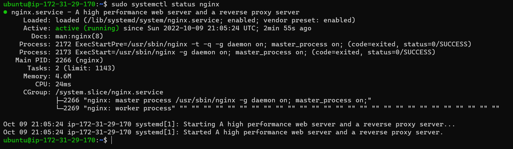

**PROJECT 2 IMPLEMENTATION/DOCUMENTATION (LEMP)**

## STEP 1 – INSTALLING THE NGINX WEB SERVER

### Since this is our first time using apt for this session, I started off by updating server package index. Following that, I used apt install to get Nginx installed
`sudo apt update`

`sudo apt install nginx`

### To verify that nginx was successfully installed and is running as a service in Ubuntu, below code was run for confirmation
`sudo systemctl status nginx`

### Accessing the installed server which is running locally using IP address and DNS name, the 2 commands which actually do pretty much the same task
`curl http://127.0.0.1:80`

`curl http://localhost:80`

### Accessing the installed server which is running on the web browser using either IP address or DNS name, the 2 commands which actually do pretty much the same task
[Log-in-the-nginx-server](http://54.90.138.220)

### The public IP address can also be retrieved using the following command other than in the AWS web console
`curl -s http://169.254.169.254/latest/meta-data/public-ipv4`

## STEP 2 – INSTALLING MYSQL

### Installation of MYSQL server
`sudo apt install mysql-server`

### MYSQL server connection as the administartive database user root
`sudo mysql`

### Runing security script
`ALTER USER 'root'@'localhost' IDENTIFIED WITH mysql_native_password BY 'PassWord.1';`

### Exiting mysql

`mysql> exit`

### INTERRACTIVE SCRIPT 
`sudo mysql_secure_installation`

### TESTING LOGIN INTO MYSQL
`sudo mysql -p`

### THEN I EXIT MYSQL TO PROCEED TO THE NEXT STEP
`exit`

## STEP 3 – INSTALLING PHP

### Installation of 2 packages of php-fpm php-mysql at once 
`sudo apt install php-fpm php-mysql`

## STEP 4 – CONFIGURING NGINX TO USE PHP PROCESSOR

### Creation of the root web directory for my domain 
`sudo mkdir /var/www/projectLEMP`

### Assigning ownership of the directory with the $USER environment variable 
`sudo chown -R $USER:$USER /var/www/projectLEMP`

### Opening a new configuration file in Nginx’s sites-available directory
`sudo nano /etc/nginx/sites-available/projectLEMP`

### Activation of my configuration by linking to the config file from Nginx’s sites-enabled directory
`sudo ln -s /etc/nginx/sites-available/projectLEMP /etc/nginx/sites-enabled/`

### Testing configuration for syntax error

`sudo nginx -t`

### Disabling default Nginx host that is currently configured to listen on port 80
`sudo unlink /etc/nginx/sites-enabled/default`

### Reloading nginx to apply changes

`sudo systemctl reload nginx`

### Reloading nginx to apply changes

`sudo echo 'Hello LEMP from hostname' $(curl -s http://169.254.169.254/latest/meta-data/public-hostname) 'with public IP' $(curl -s http://169.254.169.254/latest/meta-data/public-ipv4) > /var/www/projectLEMP/index.html`

## STEP 5 – TESTING PHP WITH NGINX

### creating a test PHP file in my document root

`sudo nano /var/www/projectLEMP/info.php`

### Removing the file created because of the sensitive info contained, the file can always be regenerated if need be

`sudo rm /var/www/your_domain/info.php`

## STEP 6 – RETRIEVING DATA FROM MYSQL DATABASE WITH PHP (CONTINUED)

### Firstl, I connected to the MySQL console using the root account:
`sudo -u root -p`

### Creating a new database, by runing the following command from my MySQL console:
`CREATE DATABASE 'example_database`;`

### Created new user and granted all previledges on the database created
`CREATE USER 'example_user'@'%' IDENTIFIED WITH mysql_native_password BY 'password';`

### Given the user permission over the created database
`GRANT ALL ON example_database.* TO 'example_user'@'%';`

### Exiting MYSQL shell
`exit`

### Testing the new user has the proper permission by loggin into MYSQL console again
`mysql -u example_user -p`

### Confirmed that I have access to my database
`SHOW DATABASES;`

### Creating a table named todo_list
`CREATE TABLE example_database.todo_list (
mysql>     item_id INT AUTO_INCREMENT,
mysql>     content VARCHAR(255),
mysql>     PRIMARY KEY(item_id)
mysql> );`

### Inserting a few rows of content in the test table. With repeat of the following command a few times, using different VALUES
`INSERT INTO example_database.todo_list (content) VALUES ("My first important item");`

### After confirming that I have valid data in my test table, I then exit the MySQL console:
`exit`

### Creating a PHP script that will connect to MySQL and query for my content. PHP file cane be created in your custom web root directory using your preferred editor. 
`nano /var/www/projectLEMP/todo_list.php`

### Then, the following PHP script connects to the MySQL database and queries for the content of the todo_list table, displays the results in a list. If there is a problem with the database connection, it will throw an exception
`exit`

### And finally, I was able to log into my database via my web browser using IP address or domain name followed by /todo_list.php

**PROJECT 2 IMPLEMENTATION/DOCUMENTATION (LEMP) IS SUCCESSFULLY DONE WITH**
